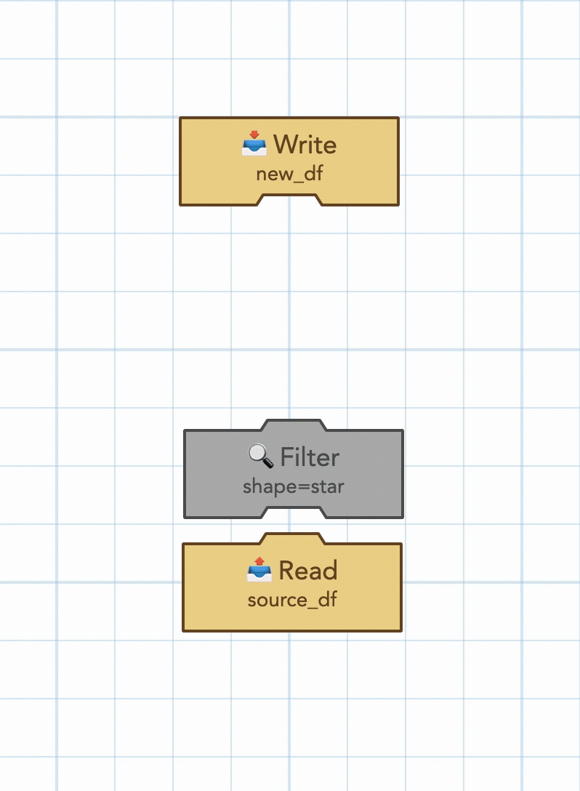
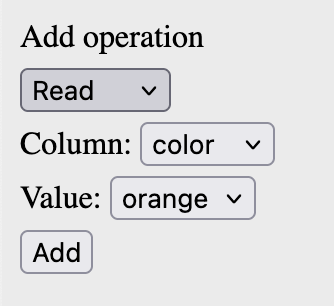
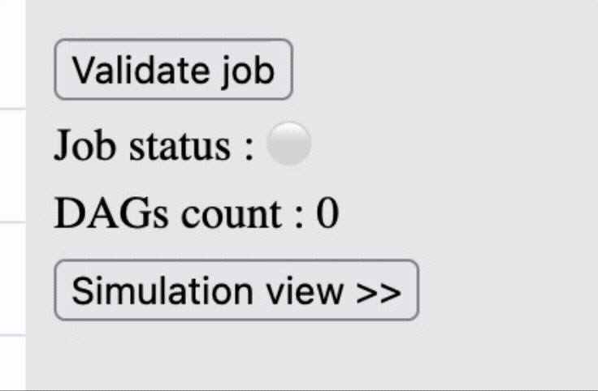
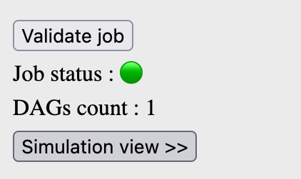
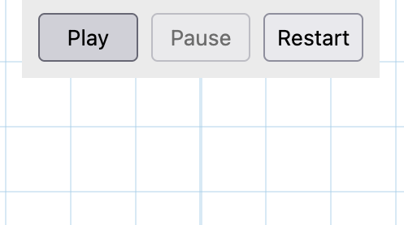

# Play ETL

**Play ETL** is an interactive simulation game where you play as a Data Engineer. Your mission is to build efficient **Data Pipelines** and **ETL** processes to produce a given Dataframe, all by avoiding performance bottlenecks and execution failures.

Master **Data Pipelines** and **ETLs** (Extract-Transform-Load) by playing :

## How to Play
### Data Structure
For simplification, all Dataframes share the same schema, which is as follows :

| Column    | Type  | Possible Values   |
|-----------|-------|---------|
| Shape     | String| "star", "diamond" |
| Color     | String| "green", "purple", "orange" |
| Label     | String| Any letter or digit   |

### Build ETL DAGs
#### Add Operations
In the **DAG Edit View**, you can add operations using the top-left panel.

In the current version, there are 4 possible operations :
- **Read** : Used to read rows from the **Source Dataframe** and chain them to the next operations
- **Write** : Used to write rows from the previous operations to the **Target Dataframe**
- **Filter** : Used to filter the incoming rows using a given column condition
- **Update** : Used to override the values of the specified column for all the incoming rows

#### Stack Operations
A valid DAG consists of a group of operations blocks.
You can drag-and-drop operations blocks in order to connect them together.
Each DAG must start with a **Read Operation** block and end with a **Write Operation** block. It can contain any number of intermediate transformation blocks (Filters / Updates).

#### Delete Operations
You can delete any operation by double-clicking on its block.

### Validate ETL DAGs
Once you finish building a DAG, you need to validate it using the **Validate job** button in the top-right panel of the **DAG Edit View**.

A DAG is valid if there is no block that's left unconnected. The validation state is indicated with a green dot 🟢 in the top-right panel when the DAG structure is correct. A DAG must be valid before you can execute its simulation.

### Simulate ETL DAGs Execution
Once your DAG is ready, you can go to the **Simulation View** to see it in action! You can access the **Simulation View** by clicking on the **>>Simulation View** button in the top-right panel of the **DAG Edit View**.

Once there, you can control the simulation using the **Play**, **Pause** and **Restart** buttons.

A Dataframe is represented with a set of visual shapes. Each shape represents a single row that has 3 columns (shape, color, label) as explained above. In other words, a green "star" shape that has a "C" label is the visualisation of the row (shape="star", color="green", label="A").

**Note:** The current version supports the execution of 1 DAG only. In case many DAGs are built in the **DAG Edit View**, only the first one is displayed in the **Simulation View**.

## Roadmap

This is still a very minimal version. The following features are being built and will be added soon :
- [ ] Add multiple game levels
- [ ] Add distributed computing with multiple nodes
- [ ] Add Narrow Transformations (Joins, Distinct, ...)
- [ ] Add Data Partitionning & Shuffling
- [ ] Add Sound Effects
- [ ] Add complex column operations (AND, OR, ...) in transformations
- [ ] Allow Read/Write operations on custom Dataframes
- [ ] Add OutOfMemory failures and Data Spills
- [ ] Add multiple DAGs and Stages simulation support

## Built With

- JavaScript
- Konva.js
- HTML/CSS